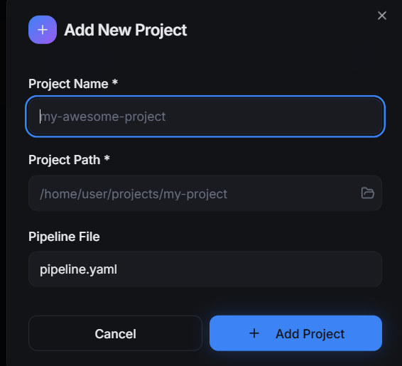
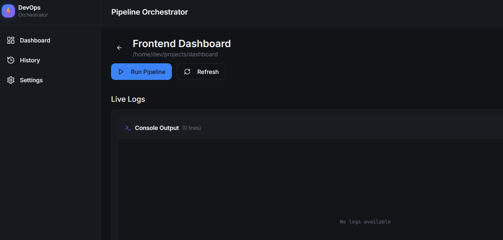

# 🚀 GitFlow – Lightweight CI/CD Orchestrator

**Tech Stack:** Go · React · Docker · WebSockets · Gin · TailwindCSS  

DevFlow is a **self-hosted CI/CD automation tool** that executes YAML-defined workflows inside Docker containers, streams real-time logs locally!!.  
---

## 🌟 Features

✅ **Pipeline as Code:** Define multi-stage workflows using simple YAML files  
✅ **Dockerized Execution:** Each job runs in an isolated container  
✅ **Real-Time Logs:** WebSocket streaming from Go backend to React UI  
✅ **Modern UI:** Built with React + Tailwind + Framer Motion for smooth animations  

---

## ⚙️ Setup Instructions

Below is the following instructions of how to setup the project for your system.

### 1️⃣ Clone the Repository

Clone the repository and use the following command to install the project inside 
your system. 
```bash
git clone https://github.com/<your-username>/gitflow.git
cd gitflow

```

## 🏃‍♂️ Build & Run with Docker Compose
Copy and Run the following command to run the frontend and backend of the project,
and navigate to the give localhost address. 

```bash
cd backend && make build && make run
cd frontend && npm i && npm run dev

```
- **Backend** → [http://localhost:8000](http://localhost:8000)  
- **Frontend** → [http://localhost:5173](http://localhost:8080)


## Example for running workflow. 

**Create Project**
Create a new test-project directory in your system 
```
mkdir test-project
```

**Copy Location of project**
use this command to know the exact location of your project that will be used during
creation of the project.
```
cd test-project
pwd
```

**Create YAML**
copy the following yaml structure, create new file and paste the content inside the file.

Note that the jobs are for golang only . 
```
name: Build & Test
jobs:
  build:
    image: golang:1.23
    steps:
      - run: go build -o app .
  test:
    image: golang:1.23
    steps:
      - run: go test ./...

```

**Creating the pipeline**
paste the project/directory that you want to run using pwd command, and include the pipeline yaml file.




**Run Pipeline**
Click on the Run button to see the logs.



### To Do's
Currently this is a MVP project here are some feature that will be added soon.

- Divide the logs into stages to differentiate logs for each jobs.
- Visualize the jobs inside the workflow to view the dependencies of jobs.
- Store the result of the pipeline into database possibly PostgreQL/SQLite

